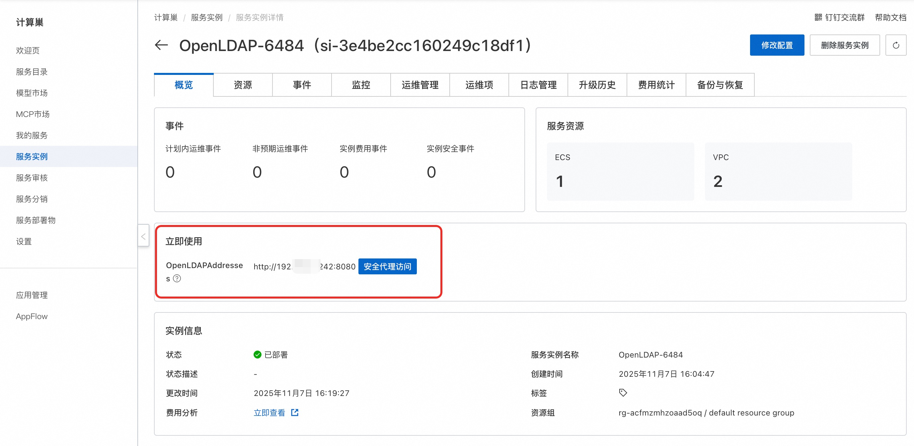

## 🌟 服务简介

**OpenLDAP** 是一个开源的、跨平台的 **轻量级目录访问协议（LDAP）** 实现，用于集中存储和管理网络中的身份信息、组织结构、设备配置等目录数据。它遵循 IETF 制定的 LDAPv3 标准（RFC 4511），是 Linux/Unix 系统中最广泛使用的开源目录服务解决方案🚀 部署流程

## 🚀 部署流程

1. 访问计算巢OpenLDAP社区版[部署链接](https://computenest.console.aliyun.com/service/instance/create/cn-hangzhou?type=user&ServiceId=service-f441b57117d8460385dd)，按提示填写部署参数：
   
2. 参数填写完成后可以看到对应询价明细，确认参数后点击**下一步：确认订单**。
3. 确认订单完成后同意服务协议并点击**立即创建**进入部署阶段。
4. 等待部署完成后进入服务实例详情页。
   
5. 点击服务地址并使用OpenLDAP社区版。
   

# 📚 使用指南

更多用法请参考OpenLDAP[官网文档](https://www.openldap.org)。
